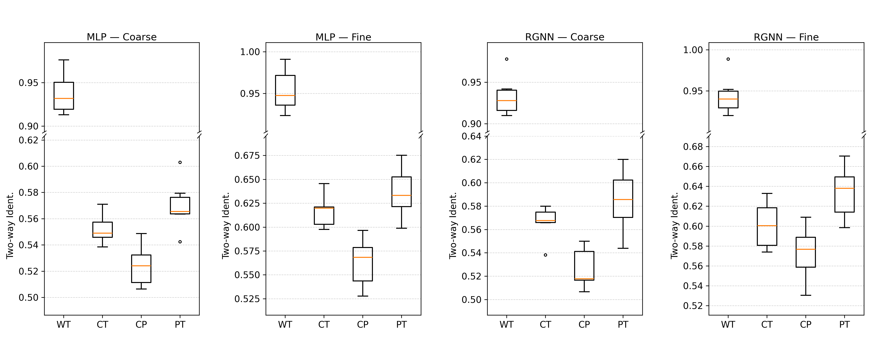

# EEG-ImageNet

This is the official repository for the paper "**EEG-ImageNet: A Benchmark for Pre-training and Cross-Time Generalization of EEG-based Visual Decoding**".

## Dataset Description

The dataset is available for download through the provided cloud storage(detailed information will be released after review). 

The dataset in EEG-ImageNet contains a total of 63,850 + 24,000 EEG-image pairs from 16 participants, with a total of 22 sessions (i.e., 6 participants took part in two sessions each). 
Each EEG data sample has a size of (n_channels, $f_s \cdot T$), where n_channels is the number of EEG electrodes, which is 62 in our dataset; $f_s$ is the sampling frequency of the device, which is 1000 Hz in our dataset; and T is the time window size, which in our dataset is the duration of the image stimulus presentation, i.e., 0.5 seconds.
Due to ImageNet's copyright restrictions, our dataset only provides the file index of each image in ImageNet and the wnid of its category corresponding to each EEG segment.

**Figure 1**: Schematic Diagram of the Data File Storage Structure. 

**Table 1**: The Statistics of dataset in EEG-ImageNet.

| #Categories | #Images | #Subjects | #EEG-image pairs | Datasize |
|-------------|---------|-----------|------------------|----------|
| 80          | 4000    | 16        | 87,850           | 20.85GB  |

Our experiment consists of two stages. 
The first stage follows the same setup as [Spampinato et al., 2017] where images from each category are presented consecutively, with $N = 50$ as shown in Figure 2. 
All of 16 participants took part in this stage. 
However, as [Li et al., 2020] pointed out, the experimental results under the paradigm of such block-design may be influenced by temporal effects when using shuffled training and test sets. 
Therefore, we conducted a second stage of the experiment, with $N=30/20$ and random shuffling. 
Six participants participated in this phase.
Stage 2 was conducted at least seven days after Stage 1. 
The 7-day interval was intended to prevent potential biases arising from memory effects.
Ultimately, the dataset we construct includes the EEG signals of participants exposed to each image visual stimulus in each valid session, along with the corresponding category's wnid and the image's index in ImageNet21k.

**Figure 2**: The overall procedure of our dataset construction. The experimental paradigm involves four steps: S1: Category Presentation (displaying the category label), S2: Fixation (500~ms), S3: Image Presentation (each image displayed for 500~ms), and S4: an optional random test to verify participant engagement. The stimuli images are sourced from ImageNet21k, with EEG signals aligned to image indices, granularity levels, and labels. Data flow is indicated by blue arrows, while collected data is highlighted in gray. Stage 2 experiment is conducted after a 7-day interval, adopting a non-block-design experimental paradigm. The same colors represent the same categories.

## Benchmark Settings

**Figure 3**: Comparison of the training and testing sets used for each task in EEG-ImageNet.. 

We conduct evaluations on EEG-based visual decoding with four tasks, **Within-Time** (WT), **Cross-Time** (CT), **Cross-Participant** (CP), and **Pre-training** (PT).
As shown in Figure 3, WT using 30 images per category for training and 20 images per category for testing. 
As WT adopted a non-block-design paradigm in which images used for training and testing are temporally separated, the results are free from class-specific temporal bias.
CT and CP is conducted to investigate cross-time and cross-participant generalization of EEG-based visual decoding. 
In CT, training and testing were performed on the same participant, while in CP, training was performed on Stage 1 data from 10 participants who did not take part in Stage 2.
Finally, we investigated cross-subject, cross-time pre-training experiments~(PT) to investigate whether pre-training on other participants’ data could improve recognition performance in cross-time classification. 
This setting enables us to examine the benefits of leveraging additional subjects for pre-training in enhancing the robustness and generalization of visual decoding models.
On our multi-granularity labeled image dataset, we test the above tasks with different levels of granularity.

## Results Presentation

The coarse-grained represents the 40-class classification accuracy; and the fine-grained represents the average accuracy of five 8-class classification tasks. 

Table 2: The average results of all participants in the coarse-grained classification task. * indicates the use of time-domain features, otherwise the use of frequency-domain features. † indicates that the difference compared to random is significant with p-value < 0.05.

| Model         | Method       | WT               | CT               | CP               | PT               |
|---------------|--------------|------------------|------------------|------------------|------------------|
| Classic model | Ridge        | 0.861±0.022†     | 0.509±0.011      | 0.501±0.007      | 0.508±0.010      |
|               | KNN          | 0.892±0.026†     | 0.517±0.019      | 0.491±0.006      | 0.521±0.017      |
|               | RandomForest | 0.909±0.031†     | 0.511±0.019†     | 0.507±0.011      | 0.524±0.020†     |
|               | SVM          | 0.935±0.039†     | 0.536±0.018†     | 0.506±0.015      | 0.544±0.017†     |
| Deep model    | MLP          | **0.938±0.024**† | 0.552±0.012†     | 0.524±0.016†     | 0.570±0.020†     |
|               | EEGNet*      | 0.878±0.022†     | 0.519±0.015†     | 0.509±0.012      | 0.524±0.022†     |
|               | RGNN         | 0.933±0.025†     | **0.566±0.015**† | **0.526±0.018**† | **0.585±0.027**† |

Table 3: The average results of all participants in the fine-grained classification task. * indicates the use of time-domain features, otherwise the use of frequency-domain features. † indicates that the difference compared to random is significant with p-value < 0.05.

| Model         | Method       | WT                | CT                | CP                | PT                |
|---------------|--------------|-------------------|-------------------|-------------------|-------------------|
| Classic model | Ridge        | 0.886±0.023†      | 0.549±0.017†      | 0.495±0.007       | 0.543±0.012†      |
|               | KNN          | 0.909±0.025†      | 0.554±0.017†      | 0.505±0.010       | 0.551±0.015†      |
|               | RandomForest | 0.922±0.030†      | 0.587±0.022†      | 0.511±0.012       | 0.595±0.019†      |
|               | SVM          | 0.949±0.035†      | 0.592±0.021†      | 0.509±0.019       | 0.606±0.022†      |
| Deep model    | MLP          | **0.954±0.026**†  | **0.617±0.019**†  | 0.563±0.026†      | **0.636±0.027**†  |
|               | EEGNet*      | 0.893±0.023†      | 0.566±0.027†      | 0.522±0.026†      | 0.579±0.025†      |
|               | RGNN         | 0.945±0.024†      | 0.601±0.024†      | **0.573±0.028**†  | 0.634±0.027†      |

Figure 4: Cross-Task comparison of MLP and RGNN performance with different granularity levels.

Both models follow the same trend ordering: $\mathrm{WT} \gg \mathrm{PT} > \mathrm{CT} > \mathrm{CP}$. 
This indicates that within-time classification remains the easiest task, while cross-participant is consistently the most challenging.
This trend aligns with prior works that have compared cross-subject and cross-session EEG decoding, which often report that the most difficult scenario is generalization across participants. 
Our results not only corroborate this conventional wisdom but also further demonstrate that pre-training on data from other participants can significantly boost object classification performance relative to direct cross-time generalization.
